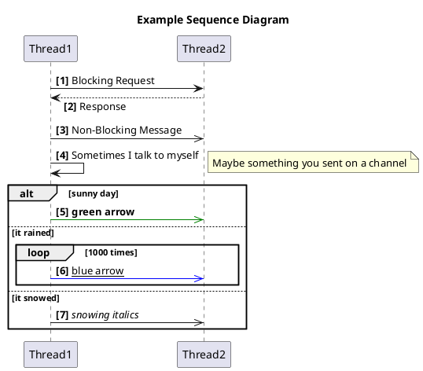
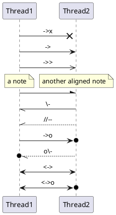
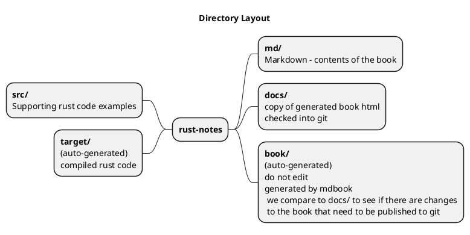
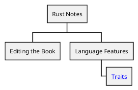
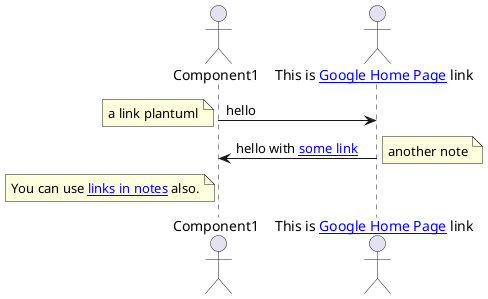

# Editing the Book

- Having [created the book](./create_book.md)
- Run `./watch.sh`
- Keep the `SUMMARY.md` file open in order to add new pages
  - Ctrl + Click will open the editor for a page link
- If you edit any file under the `md` folder you should see the book regenerated in the terminal where the `watch.sh` is running.
  - The message `The mdbook-plus preprocessor not running ...` can be ignored.

<table>
<tr><th>Markdown</th></tr>
<tr><td>
<pre>
  plantuml
@startuml
autonumber "&lt;b&gt;[0]"
skinparam responseMessageBelowArrow true
title Example Sequence Diagram

Thread1 -> Thread2: Blocking Request
Thread1 <-- Thread2: Response
Thread1 ->> Thread2: Non-Blocking Message
Thread1 -> Thread1: Sometimes I talk to myself

note right
Maybe something you sent on a channel
end note

alt sunny day
  Thread1 -[#green]>> Thread2: **green arrow**
else it rained
  loop 1000 times
  Thread1 -[#blue]>> Thread2: __blue arrow__
  end
else it snowed
  Thread1 ->> Thread2: //snowing italics//
end

@enduml
</pre>
</td></tr>
<tr><th>Generated Image</th></tr>
</td><td>

</td></tr>
</table>

## Supporting Diagrams
[Plantuml](https://plantuml.com/) is used to generate supporting diagrams.
Using [mdbook-plantuml](https://crates.io/crates/mdbook-plantuml) postprocessor we can use markdown to represent the diagrams and a corresponding image file will be generated upon book generation.

## Book Layout

```plantuml
@startsalt
{
{T
+ [[../index.html Book]]
++ [[../README.html Readme]]
++ [[../intro.html Introduction]]
++ [[../edit_book.html Editing the Book]]
+++ [[../create_book.html Creating a Book]]
+++ [[../mdbook/preprocessor.html mdbook preprocessor]]
++ [[../cargo.html Cargo]]
++ [[../crates/crates.html Crates]]
+++ [[../crates/executable-crates/executable-crates.html Executable Crates]]
++++ [[../crates/ripgrep.html ripgrep]]
++++ [[../crates/anymap.html anymap]]
++++ [[../crates/notify.html notify]]
++ [[../github_init.html Storing on GitHub]]
++ [[../sample_code.html Sample Code]]
+++ [[../samples/hello_world.html Hello World]]
++++ [[../samples/rust_cookbook.html Rust Cookbook]]
++++ [[../samples/rosetta.html Rosetta Code]]
+++++ [[../samples/rosetta/100_doors.html 100 Doors]]
+++++ [[../samples/rosetta/100_prisoners.html 100 Prisoners]]
+++++ [[../samples/rosetta/15_puzzle_game.html 15 Puzzle Game]]
+++++ [[../samples/rosetta/15_puzzle_solver.html 15 puzzle solver]]
++ [[../linux.html Linux Environment]]
+++ [[../non_rust.html Non-Rust Utilities]]
++++ [[../terminator.html Terminator]]
++ [[../language_features.html Language Features]]
+++ [[../language_features/destructor.html Destructuror]]
++++ [[../language_features/memory.html Memory]]
++++ [[../language_features/macros.html Macros]]
++++ [[../language_features/traits.html Traits]]
+++++ [[../language_features/trait_objects.html Trait Objects]]
++++++ [[../language_features/object_safety.html Object Safety]]
++++++ [[../language_features/traits/memory.html Iterator]]
++++ [[../language_features/enums.html Enums]]
++++ [[../language_features/oop.html Object Orientation]]
++ [[../language_comparison.html Language Comparison]]
++ [[../best_practices.html Best Practices]]
++ [[../miscellaneous.html Miscellaneous]]
++ [[../glossary.html Glossary]]
++ [[../troubleshooting.html Troubleshooting]]
++ [[../quiz.html Quiz]]
++ [[../references.html References]]
+++ [[../vscode.html vscode]]
++++ [[../tools.html tools]]
}
}
@endwbs
```

