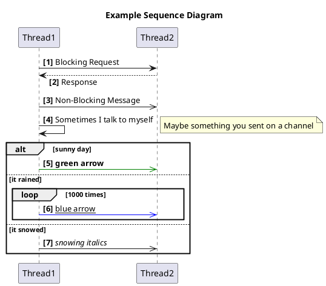
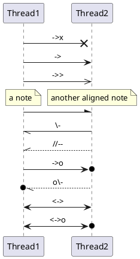
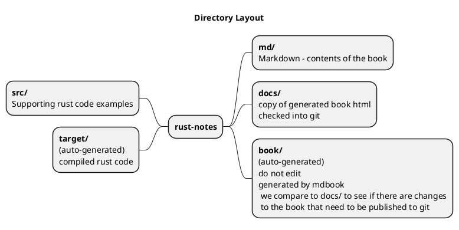
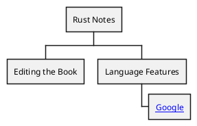
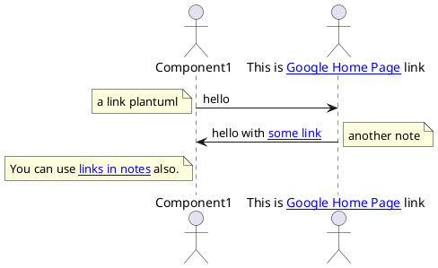

# Editing the Book

- Having [created the book](./create_book.md)
- Run `./watch.sh`
- Keep the `SUMMARY.md` file open in order to add new pages
  - Ctrl + Click will open the editor for a page link
- If you edit any file under the `md` folder you should see the book regenerated in the terminal where the `watch.sh` is running.
  - The message `The mdbook-plus preprocessor not running ...` can be ignored.

## Supporting Diagrams
[Plantuml](https://plantuml.com/) is used to generate supporting diagrams.
Using [mdbook-plantuml](https://crates.io/crates/mdbook-plantuml) postprocessor we can use markdown to represent the diagrams and a corresponding image file will be generated upon book generation.

## Book Layout

